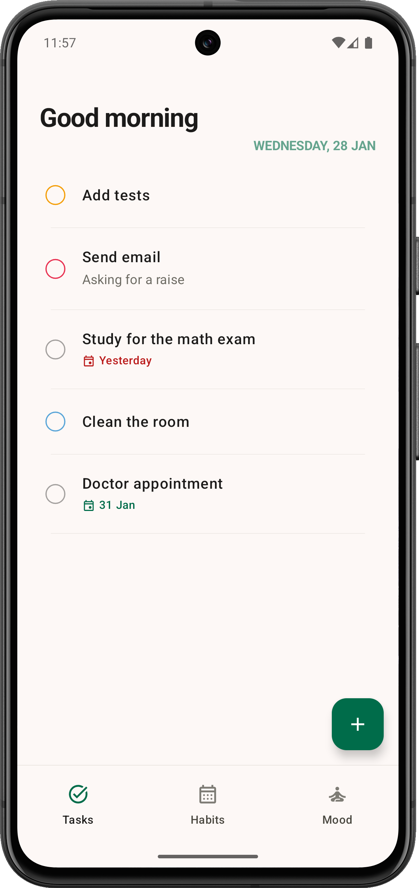
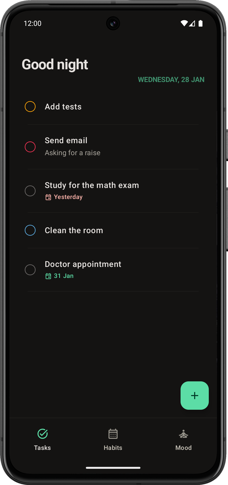

# FlowState

**A modern, intuitive task management app built with Jetpack Compose and Clean Architecture**

[](https://kotlinlang.org)
[](https://developer.android.com/jetpack/compose)
[](https://developer.android.com/training/data-storage/room)
[](https://dagger.dev/hilt/)

> **⚠️ Early Development Stage**  
> This project is actively being developed and may have bugs. We welcome contributions from the community!

## Screenshots
|  |  |
|:--------------------------------------:|:-------------------------------------:|

## Features

### Implemented
- **Task Management**: Create, edit and delete tasks
- **Priority System**: Set task priorities (High, Medium, Low, None)
- **Sub-tasks**: Break down tasks into manageable sub-tasks
- **Swipe Actions**: Swipe to delete tasks with smooth animations
- **Drag & Drop**: Reorder tasks via intuitive drag handles
- **Auto-save**: Changes are saved automatically when editing a task
- **Material 3**: Modern design with dynamic colors

### In Development
- **Overall visual improvements**: Improve the main visual aesthetics of the app
- **Habit Tracking**: Build daily routines and track streaks
- **Mood Tracking**: Log daily emotions and view trends
- **Task Scheduling**: Add due dates and reminders
- **Calendar** view
- **Widgets**: Home screen widgets for quick access
- **Themes**: More customization options
- Any new **suggestion**

## Getting Started

### Prerequisites
- Android Studio
- Android SDK 31 (Android 12)

### Installation

1. **Clone the repository**
   ```bash
   git clone https://github.com/Markel15/flowstate.git
   cd flowstate
  
2. **Open in Android Studio**

    -Open Android Studio

    -Select "Open an Existing Project"

    -Navigate to the cloned directory

3. **Build and Run**

    -Connect an Android device or start an emulator (API 31+)

    -Click the Run button

## 🤝 How to Contribute

We welcome contributions! Here's how you can help:

### Reporting Bugs
1. Check the [Issues](https://github.com/Markel15/flowstate/issues) to avoid duplicates
2. Create a new issue with:
   - Clear description
   - Steps to reproduce
   - Expected vs actual behavior
   - Screenshots/videos if possible
   - Device/OS information

### Suggesting Features
1. Check existing feature requests
2. Create an issue with:
   - Use case description
   - Mockups/wireframes if applicable
   - Priority justification

### Submitting Code
1. **Fork the repository**
2. **Create a feature branch**
   ```bash
   git checkout -b feature/amazing-feature
  
3. **Make your changes**

  - Write tests when possible
  - Update documentation when possible

4. **Commit your changes**
   ```bash
   git commit -m 'Add some amazing feature'
5. Push to the branch
   ```bash
   git push origin feature/amazing-feature
6. Open a Pull Request

## Architecture

FlowState follows **Clean Architecture** with a clear separation of concerns:

```text
UI Layer (Presentation)
├── ViewModels (TaskViewModel)
├── Composable Screens (TaskScreen)
└── UI State Management

Domain Layer (Business Logic)
├── Use Cases (Interactors)
├── Repository Interfaces
└── Domain Models (Task, SubTask, Priority)

Data Layer (Infrastructure)
├── Repository Implementations
├── Local Data Source (Room)
└── Data Models (Entities)
```


## Tech Stack

| Component      | Technology                  |
|----------------|-----------------------------|
| **UI Framework** | Jetpack Compose            |
| **Architecture** | Clean Architecture + MVVM |
| **Database**     | Room                      |
| **DI**           | Hilt                      |
| **Async**        | Kotlin Coroutines         |
| **Navigation**   | Navigation Compose        |
| **Animations**   | Compose Animation APIs    |
