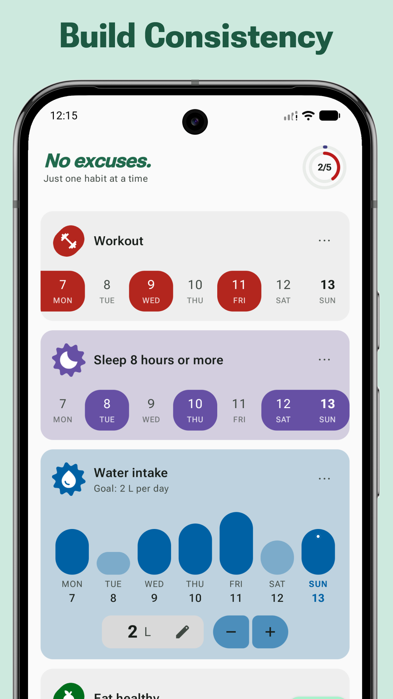
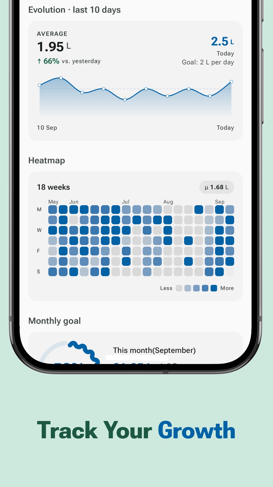
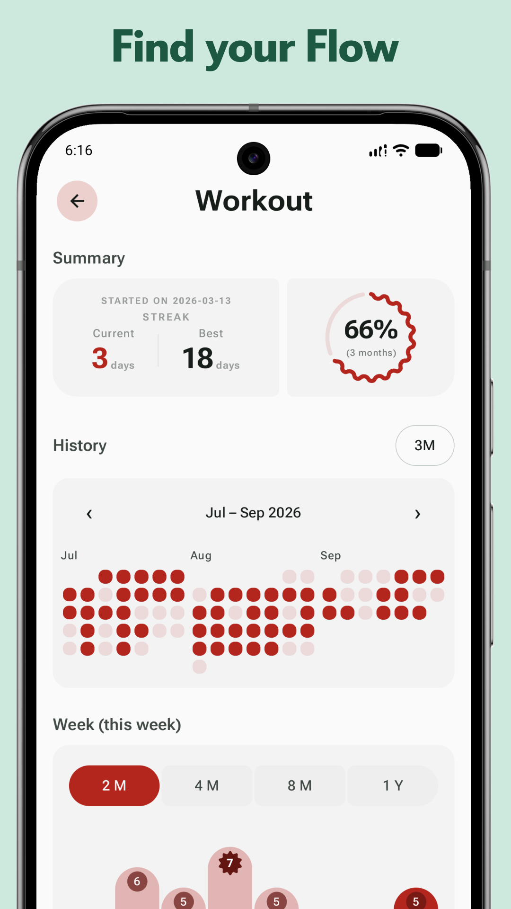

# FlowState

**Tasks, habits and notes. Free, open-source, 100% offline.**

No accounts, no ads, no tracking, no servers. Your data never leaves your phone.

[](https://github.com/Markel15/FlowState/releases/latest)
[](LICENSE)
[-3DDC84?logo=android&logoColor=white)](https://www.android.com)

## Download

**Get the latest APK :**

[](https://github.com/Markel15/FlowState/releases/latest/download/app-release.apk)

1. Download the APK (Android 12 or newer).
2. Open it and tap **Install** — Android will ask you to allow installs from your browser once.
3. That's it. Updates install on top of the previous version and the data remains.

> 💡 **Tip:** use [Obtainium](https://obtainium.imranr.dev/) to get automatic updates straight from these GitHub releases.
> Older versions and changelogs live in [Releases](https://github.com/Markel15/FlowState/releases).

## Screenshots

<p align="center" width="100%">
  
</p>

## Features

**Tasks**
- Create, edit and delete tasks with **sub-tasks**, priorities and due dates
- Swipe actions and drag & drop reordering
- Auto-save while editing and reminders

**Habits**
- Boolean and **numeric** habits (kilometers, glasses of water, minutes…)
- Streaks and progress statistics
- Home-screen **widgets**

**Notes, checklists & ideas** — quick capture built in

**Calendar view** of your schedule

**Make it yours**
- Material 3 Expressive design with **Material You** dynamic colors
- Pure black/white theme options and system font support
- Reorderable category tabs — organize the app your way
- English & Spanish

**Privacy by design**
- 100% offline: no accounts, no analytics, no tracking
- Local database only, with **backup & restore**

### Planned / in progress
- More widgets
- Mood tracking
- Your suggestions → [open an issue](https://github.com/Markel15/flowstate/issues)

## Motivation

I wanted to build a fully-featured Android app that is completely **free**, **ad-free** and **privacy-focused** — no servers, no tracking, no data collection, working 100% offline.
This project was also a way for me to learn modern **Kotlin** (coming from a Java-only background) while creating something truly **customizable** that others can easily modify, extend and adapt.

<details>
<summary><b>Build from source</b></summary>

### Prerequisites
- Android Studio
- Android SDK 31 (Android 12)

### Installation

1. **Clone the repository**
   ```bash
   git clone https://github.com/Markel15/flowstate.git
   cd flowstate
   ```
2. **Open in Android Studio** → *Open an Existing Project* → select the cloned directory.
3. **Build and Run** on a device or emulator running API 31+.

</details>

<details>
<summary><b>Architecture & tech stack</b></summary>

FlowState follows **Clean Architecture** with a clear separation of concerns:

```text
UI Layer (Presentation)
├── ViewModels
├── Composable Screens
└── UI State Management

Domain Layer (Business Logic)
├── Use Cases (Interactors)
├── Repository Interfaces
└── Domain Models (Task, SubTask, Habit)

Data Layer (Infrastructure)
├── Repository Implementations
├── Local Data Source (Room)
└── Data Models (Entities)
```

| Component      | Technology                |
|----------------|---------------------------|
| **UI Framework** | Jetpack Compose           |
| **Architecture** | Clean Architecture + MVVM |
| **Database**     | Room                      |
| **DI**           | Hilt                      |
| **Async**        | Kotlin Coroutines         |
| **Navigation**   | Navigation 3              |
| **Animations**   | Compose Animation APIs    |

[](https://kotlinlang.org)
[](https://developer.android.com/jetpack/compose)
[](https://developer.android.com/training/data-storage/room)
[](https://dagger.dev/hilt/)

</details>

## How to contribute

Contributions are welcome!

- **Found a bug?** Check the [Issues](https://github.com/Markel15/flowstate/issues) to avoid duplicates, then open one with a clear description, steps to reproduce, expected vs actual behavior, and screenshots/device info if possible.
- **Have an idea?** Open an issue describing the use case (mockups welcome).
- **Want to code?** Fork the repo, create a feature branch (`git checkout -b feature/amazing-feature`), make your changes (tests and docs when possible), and open a Pull Request.

## License

FlowState is open-source software licensed under the [Apache License 2.0](LICENSE).
